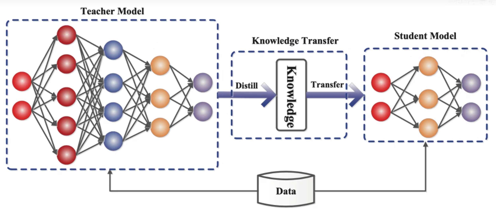
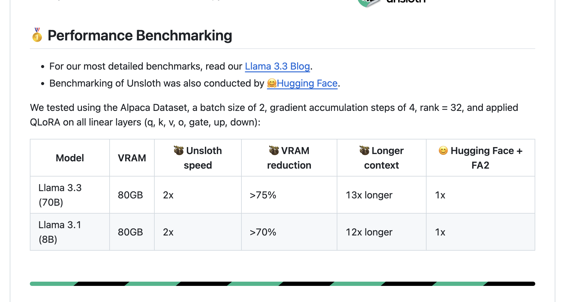
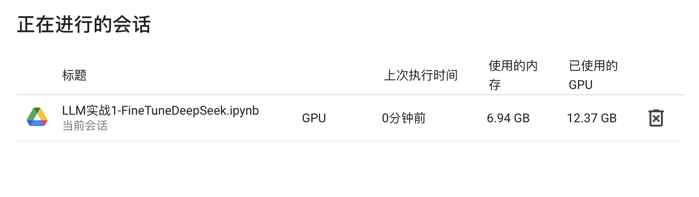

## Fine Tune DeepSeek

## 1. 参考材料

1. [Fine-Tuning DeepSeek R1 (Reasoning Model)](https://www.datacamp.com/tutorial/fine-tuning-deepseek-r1-reasoning-model)
2. [Unsloth 微调框架](https://github.com/unslothai/unsloth)
3. [Rosenberg/CMeEE-V2 数据集](https://huggingface.co/datasets/Rosenberg/CMeEE-V2)
4. [FreedomIntelligence/medical-o1-reasoning-SFT 数据集](https://huggingface.co/datasets/FreedomIntelligence/medical-o1-reasoning-SFT)
5. [DeepSeek-R1-Distill-Llama-8B 模型（HuggingFace）](https://huggingface.co/unsloth/DeepSeek-R1-Distill-Llama-8B)
6. [Uncloth-SFT 文档](https://huggingface.co/docs/trl/main/en/sft_trainer)

#### 2.任务目标：

我们将对 DeepSeek-R1-Distill-Llama-8B 模型进行微调，该过程将在 Hugging Face 的 Medical Chain-of-Thought 数据集上完成。这个经过蒸馏的 DeepSeek-R1 模型是通过在使用 DeepSeek-R1 生成的数据上对 Llama 3.1 8B 模型进行微调而创建的，它展示了与原始模型相似的推理能力。

#### 3.模型介绍

##### 3.1 知识蒸馏

知识蒸馏就是把一个大的教师模型的知识萃取出来，把他浓缩到一个小的学生模型，可以理解为一个大的教师神经网络把他的知识教给小的学生网络，这里有一个知识的迁移过程，从教师网络迁移到了学生网络身上，教师网络一般是比较臃肿，所以教师网络把知识教给学生网络，学生网络是一个比较小的网络，这样就可以用学生网络去做一些轻量化网络做的事情。



知识蒸馏使用的是Teacher—Student模型，其中teacher是“知识”的输出者，student是“知识”的接受者。知识蒸馏的过程分为2个阶段:

- **原始模型训练:** 训练"Teacher模型", 简称为Net-T，它的特点是模型相对复杂，也可以由多个分别训练的模型集成而成。我们对"Teacher模型"不作任何关于模型架构、参数量、是否集成方面的限制，唯一的要求就是，对于输入X, 其都能输出Y，其中Y经过softmax的映射，输出值对应相应类别的概率值。
- **精简模型训练:** 训练"Student模型", 简称为Net-S，它是参数量较小、模型结构相对简单的单模型。同样的，对于输入X，其都能输出Y，Y经过softmax映射后同样能输出对应相应类别的概率值。
- Teacher学习能力强，可以将它学到的知识迁移给学习能力相对弱的Student模型，以此来增强Student模型的泛化能力。复杂笨重但是效果好的Teacher模型不上线，就单纯是个导师角色，真正部署上线进行预测任务的是灵活轻巧的Student小模型。

#### 4. Unsltoh介绍

Unsloth 是一款开源的 LLM 微调加速工具，具有以下显著优势：

- **加速微调：** 与传统微调方法相比，Unsloth 能够将微调速度提高约2倍，甚至更多，大幅缩短模型迭代时间。
- **降低内存占用：** Unsloth 可减少高达 80% 的内存使用，使得在有限硬件资源下也能训练大规模模型。
- **广泛的模型支持：** 框架兼容 Llama 3.1、Mistral、Phi-3.5、Gemma 等多种主流 LLM，用户可根据任务需求灵活选择模型。

#### 5.关于UnSloth微调框架的优势

1）加载模型和分词器

代码中基于 `unsloth` 的 `FastLanguageModel.from_pretrained()` 加载了模型和分词器

```python
model, tokenizer = FastLanguageModel.from_pretrained(
    model_name = "unsloth/Meta-Llama-3.1-8B",
    max_seq_length = max_seq_length,
    dtype = dtype,
    load_in_4bit = load_in_4bit,
    # token = "hf_...", # use one if using gated models like meta-llama/Llama-2-7b-hf
)
```

基于Hugging Face的 `transformers` 的模型和分词器加载方式，以此来对比一下

```python
from transformers import AutoModelForCausalLM, AutoTokenizer

model_path = './model/llama-3-8b'   # 模型的本地路径
model = AutoModelForCausalLM.from_pretrained(model_path, trust_remote_code=True, device_map='auto')
tokenizer = AutoTokenizer.from_pretrained(model_path, trust_remote_code=True)
```

2）LORA Adapter

1）代码中基于 `unsloth` 的 `FastLanguageModel.get_peft_model()` 的方式增加了 LoRA adapter，后续该模型作为参数传入 `SFTTrainer` 中。

```python
model = FastLanguageModel.get_peft_model(
    model,
    r = 16, # Choose any number > 0 ! Suggested 8, 16, 32, 64, 128
    target_modules = ["q_proj", "k_proj", "v_proj", "o_proj",
                      "gate_proj", "up_proj", "down_proj",],
    lora_alpha = 16,
    lora_dropout = 0, # Supports any, but = 0 is optimized
    bias = "none",    # Supports any, but = "none" is optimized
    # [NEW] "unsloth" uses 30% less VRAM, fits 2x larger batch sizes!
    use_gradient_checkpointing = "unsloth", # True or "unsloth" for very long context
    random_state = 3407,
    use_rslora = False,  # We support rank stabilized LoRA
    loftq_config = None, # And LoftQ
)

```

2） 本文也给出传统的基于 `peft` 的`get_peft_model` 的增加LoRA adapter 的方式，以此来对比一下

```python
from peft import LoraConfig, get_peft_model

lora_config = LoraConfig(
    r=16,
    lora_alpha=16,
    target_modules=["q_proj", "k_proj", "v_proj", "o_proj", "gate_proj", "up_proj", "down_proj",],
)

model = get_peft_model(model, lora_config)
# model.print_trainable_parameters()
```

3）性能优势



#### 6. 微调类型

在微调大语言模型时，不同的策略各有优劣，下面简单介绍三种常用方法：

##### 6.1 SFT（监督式微调，Supervised Fine-Tuning）

SFT 是指在标注数据或高质量生成数据的基础上，通过监督学习的方法对模型进行微调。该方法主要通过输入—输出对（prompt-response pairs）的学习，使模型在特定任务上表现更为精准。SFT 通常作为初始微调阶段，为后续更复杂的策略（如强化学习优化）提供良好基础。

##### 6.2 PPO（近端策略优化，Proximal Policy Optimization）

PPO 是一种广泛应用于强化学习的算法，其核心思想是通过限制策略更新的幅度，确保训练过程的稳定性。利用概率比的截断机制，PPO 能够在保证探索与开发平衡的前提下，加速策略收敛。这种方法尤其适用于需要在线反馈和动态调整策略的任务场景。

##### 6.3 GRPO（梯度重加权策略优化，Gradient Reweighted Policy Optimization）

GRPO 是在 PPO 基础上的一种改进方法，通过对梯度进行重加权调整，进一步提升策略更新的效率和鲁棒性。GRPO 在处理复杂策略学习任务时，能够更好地克服梯度消失或爆炸等问题，从而实现更为稳定和高效的优化过程。

在实际微调过程中，根据任务特点和数据质量，可以选择不同的策略组合，例如：先使用 SFT 打下基础，再利用 PPO 或 GRPO 进行精细的策略优化，以达到更好的模型性能和泛化能力。


#### 7.微调情况


