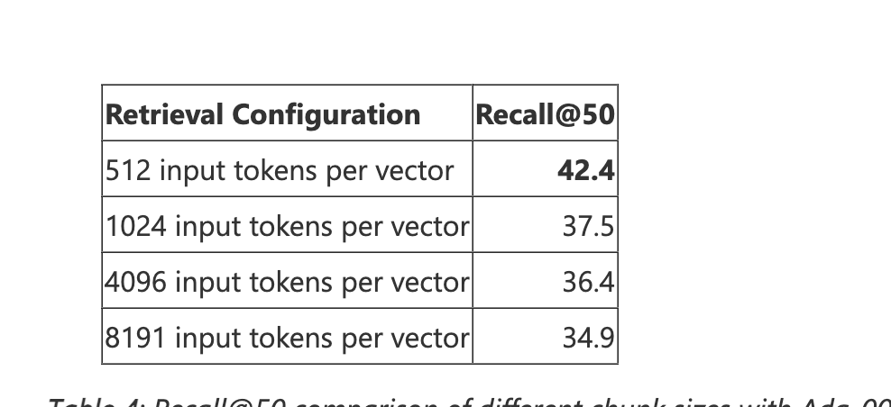
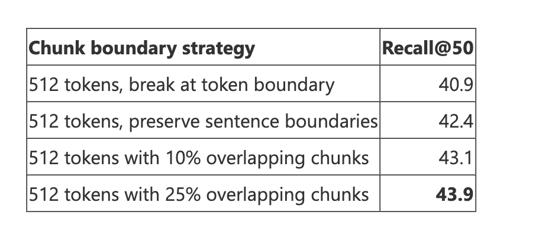
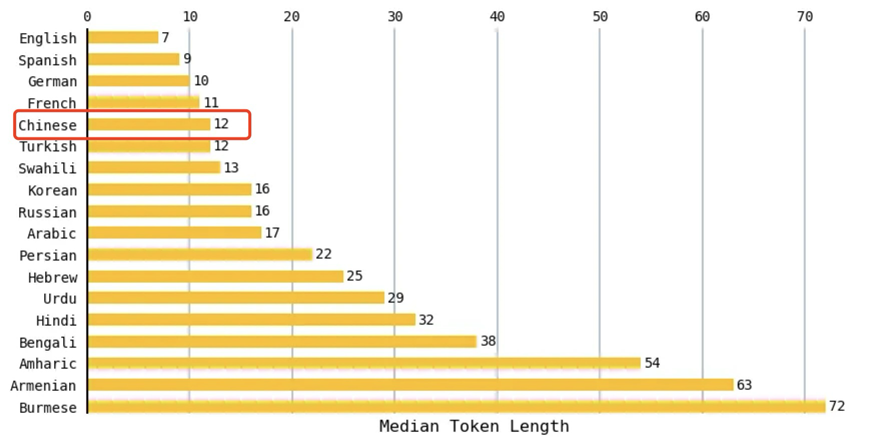
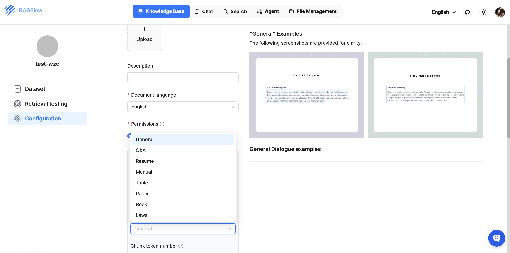
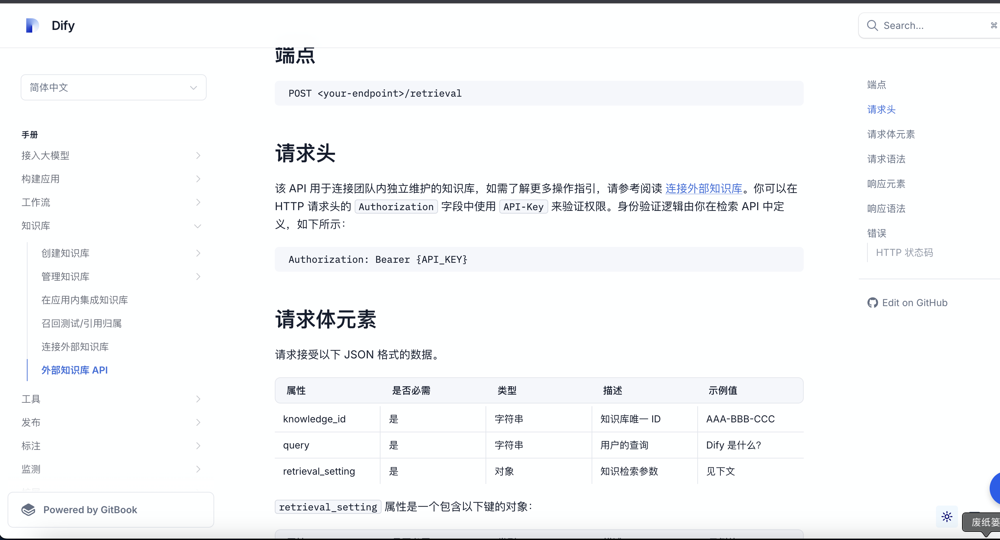

# 2025-03-06汇报

本次汇报内容涵盖了四个任务，包括1.员工办事指南RAG 2.差旅费RAG 3.医疗人员个人排班Chatflow 4.医保控费结合LLM

## **知识库搭建心得**

### **Dify 搭建内部知识库**

在使用 Dify 搭建知识库时，可以选择不同的分段设置方式。常见的分段方式有两种：

​	1.	**通用分段**：这种方式适用于没有明确层级结构的文本，将整个文档分成多个片段进行处理。

​	2.	**父子分段**（推荐）：这种方式适用于有层次结构的内容，例如章节、段落或不同的主题。每个“父”段落可以包含多个“子”段落，有助于更精细地管理和检索内容。

**Chunk的定义**

在自然语言处理（NLP）和信息检索领域，**chunk**（块）通常指的是将文本数据切分成更小的单位或片段，这些单位通常是有意义的内容单元。

**Chunk Size 是否越大越好？**

**不一定**。使用较大的文本片段进行编码可能会降低检索性能。长文本的复杂性可能导致嵌入模型在提取和检索信息时的效果变差。较小的文本片段能够提供更精确的检索结果，因为它们通常包含更少的噪音信息，能够更好地与查询进行匹配。

建议根据具体的应用场景和文本类型调整 Chunk Size，以平衡性能和检索精度。

**知识库中 Overlap Chunk 的设置**

**为什么需要设置 Overlap？**

**Overlap**（重叠）是指在将文档分割成多个片段时，片段之间会有一部分内容重叠。设置重叠的原因是为了确保每个文本片段能够共享上下文信息。

在文本中，某些关键信息可能位于片段的边界处。如果没有重叠，检索时可能会丢失这些边界信息，导致查询结果不完整或不准确。通过在相邻片段之间设置重叠部分，可以确保查询时能获得更多的上下文，从而提高信息检索的准确性和效率。

#### RAG的Token参考

**中位数次元长度的概念**

在自然语言处理中，“次元长度”或“词元长度”（token length）是指文本中基本语言单位（词元）的数量。一个词元可以是一个单词、标点符号、数字或其他语言单位。

**中位数的定义**

**中位数（median）是指一组数据中间的值**。在对文本数据进行分析时，通常会计算文本中词元数量的中位数。它是将所有文本的词元数量按大小顺序排列后，处于中间位置的值。如果有偶数个数据，则取中间两个数的平均值。

通过这个值，可以大致了解文本在该语言中的**典型长度。**

$$
中文token长度 = 推荐英文token长度 \times {\frac{12}{7}}
$$

### Dify搭建外部知识库

推荐使用RAGFlow

在Dify配置Ragflow的外部知识库

参考Ragflow

可以参考Dify的外部知识库Api文档，可见

#### 下一期需要汇报的内容

1. **员工排班**
   - 对用户问题进行使用问题分类器，分别查询科室排班，护士长排班，总值班和院领导排班；若用户没有具体提示某个特定的排班信息，再查询所有的排班数据
   - 提供员工排班查询的工作流，用模板节点聚合排班结果数据
   - 若排班为空的时候需要提示：“排班数据异常，请重试”，若有异常则直接抛出异常结束
   - 待更新：解析token获取用户ID和用户姓名，用于识别用户询问的是自己的排班还是查询其他医生的排班
2. **规则引擎病历后结构化**
   - LLM节点需要有筛选病历的下拉框 (多值表维护）；
   - 规则引擎触发时需要根据场景中包含的病历类型，从MongDB中抽取后结构化后的病历JSON串；
   - LLM节点需要维护属性，不同的病历维护不同的属性；
   - 规则引擎解析多层JSON串如何返回匹配到的键值对信息‘
3. **差旅费RAG**：
   - 输出太过于细致，做好先输出结论之后，再补上
4. **RAGFlow研究**：
   - 研究RAGFlow所有的模式，和参数配置含义

### 参考文献

\- Azure AI Search https://techcommunity.microsoft.com/t5/ai-azure-ai-services-blog/azure-ai-search-outperforming-vector-search-with-hybrid/ba-p/3929167 

\- Token与语言 https://www.artfish.ai/p/all-languages-are-not-created-tokenized

 \- Token与模型 https://huggingface.co/spaces/yenniejun/tokenizers-languages	