# 2025-03-11汇报

本次汇报内容涵盖了四个任务，包括1.RAGFLOW经验分享 2.Zotero分享及论文写作分享 3.

#### 一、员工排班查询更新

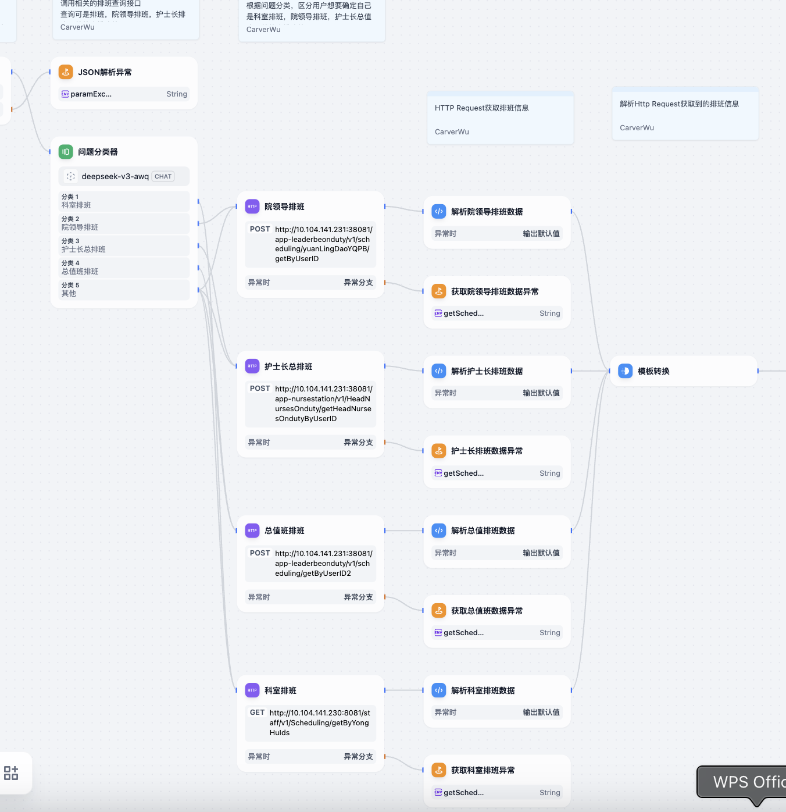

- 对用户问题进行使用问题分类器，分别查询科室排班，护士长排班，总值班和院领导排班；若用户没有具体提示某个特定的排班信息，再查询所有的排班数据
- 将原本的Chatflow更替为Workflow，用模板节点聚合排班结果数据
- 若排班为空的时候需要提示：“排班数据异常，请重试”，若有异常则直接抛出异常结束

#### 二、规则引擎汇报

**1）病历类别筛选**

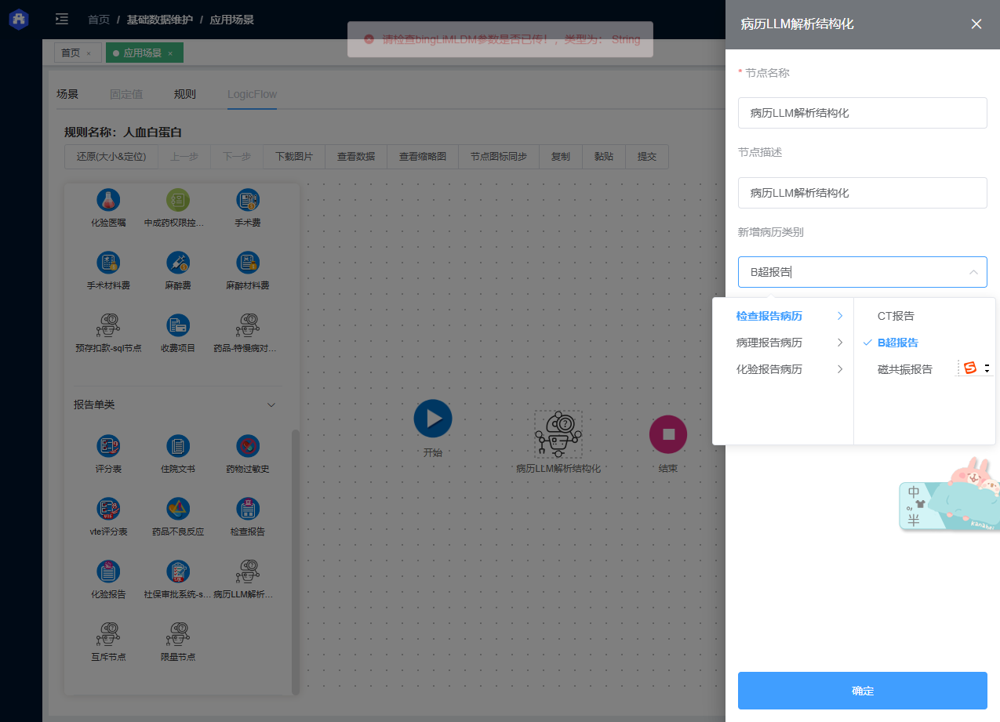**2)病历属性筛选**

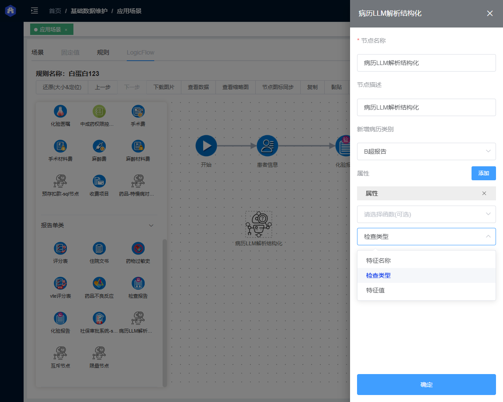

**3） 操作符配置**


**4） 规则校验**

示例json串

```json
{
  "jianChaLX": "CT",
  "bingLiLB": "CT报告单",
  "teZhengXM": [
    {
      "teZhengMC": "烧伤面积",
      "teZhengZhi": "45"
    },
    {
      "teZhengMC": "烧伤等级",
      "teZhengZhi": "三级"
    }
  ],
  "teZhengXM2": [
    {
      "teZhengMC": "烧伤面积",
      "teZhengZhi": "30"
    }
  ]
}
```


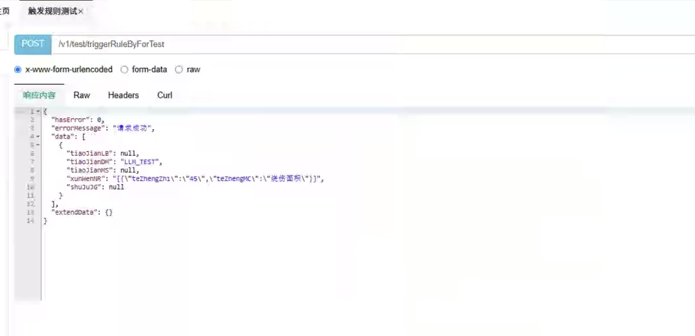

#### 三、RAGFLOW分享

1）RAGFLOW的各种文档类型

| **模版**     | Description                              | 支持的文件格式                                       |
| ------------ | ---------------------------------------- | ---------------------------------------------------- |
| General      | 文件根据预设的分块令牌数量连续分块。     | DOCX, EXCEL, PPT, PDF, TXT, JPEG, JPG, PNG, TIF, GIF |
| Q&A          | 用于做一问一答类型的文档                 | XLSX, CSV/TXT                                        |
| Manual       | 适用于PDF解析                            | PDF                                                  |
| Table        |                                          | XLSX, CSV/TXT                                        |
| Paper        |                                          | PDF                                                  |
| Book         |                                          | DOCX, PDF, TXT                                       |
| Laws         |                                          | DOCX, PDF, TXT                                       |
| Presentation |                                          | PDF, PPTX                                            |
| Picture      |                                          | JPEG, JPG, PNG, TIF, GIF                             |
| One          | 将整个文档作为一个块进行处理。（不推荐） | DOCX, EXCEL, PDF, TXT                                |

2）RAGFLOW的CHAT

Ragflow-chat：https://ragflow.io/docs/dev/start_chat

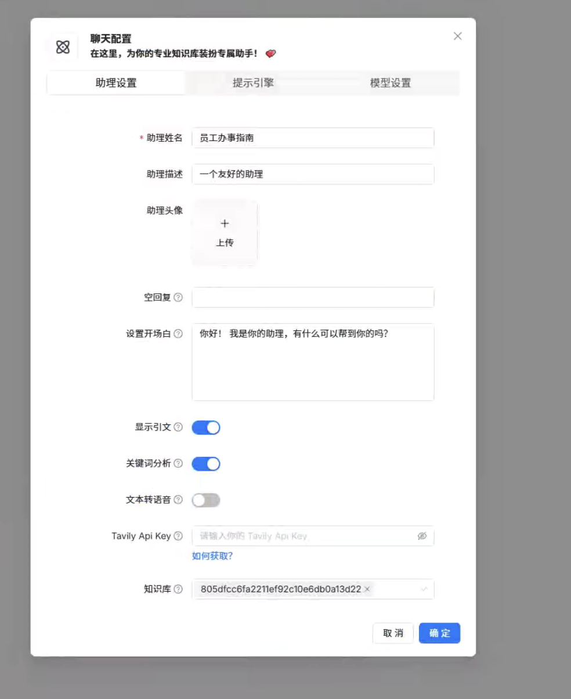

在Chat的提示词中，所有变量用{}包裹起来，其中，knowledge 变量用于在系统提示词中填充检索到的文档片段。该变量被视为特殊变量，能够动态地将检索结果嵌入到提示词中，以增强模型的回答质量

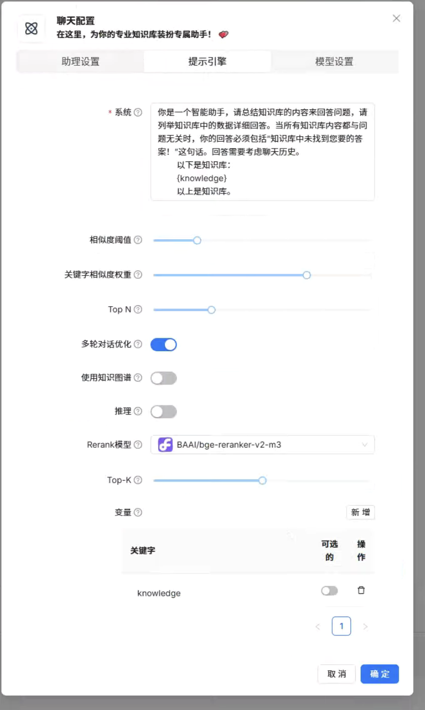

**主要功能：**

​	•	**深度文档理解：** 能够从多种复杂格式的非结构化数据中提取关键信息，确保答案的准确性和可信度。 

​	•	**模板化文本切片：** 提供多种文本切片模板，用户可根据需求选择，确保文本处理的可控性和可解释性。 

​	•	**有理有据的引用：** 在回答中提供关键引用的快照，并支持追溯源头，最大程度降低模型生成“幻觉”答案的可能性。 

​	•	**兼容多种数据源：** 支持包括 Word 文档、PPT、Excel 表格、TXT 文件、图片、PDF、扫描件、复印件、结构化数据和网页等多种数据源。 

​	•	**自动化工作流：** 提供全程自动化的 RAG 工作流，支持从个人应用到大型企业的各种生态系统，易于集成和使用


3）RAGFLOW+知识图谱

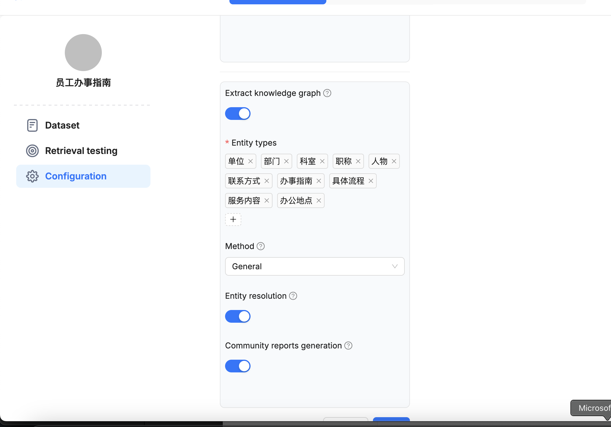

4）RAGFLOW API (RAGFLOW支持单个知识库当中的某个文档的检索)

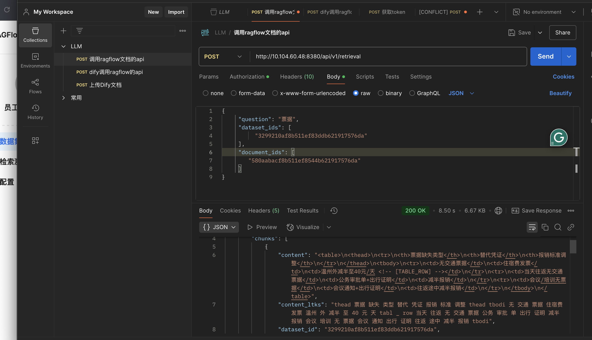

#### 四、知识库上传文档API

Dify知识库相关的api：

Ragflow知识库相关的api：

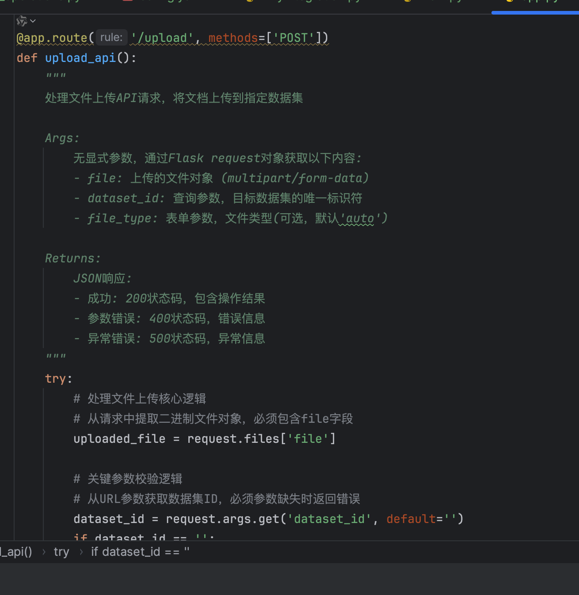

PostMan:

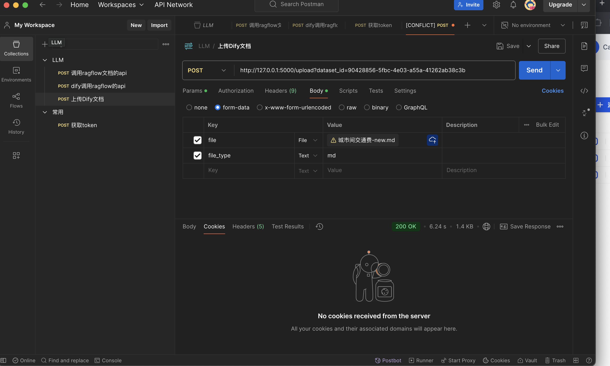

可以见到文件以及上传至dify对应的知识库当中

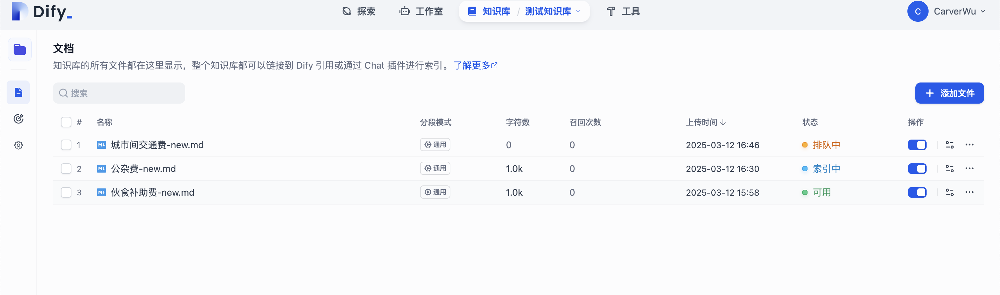

#### 五、Zotero, Grammaly分享

zotero网址：https://www.zotero.org/

zotero是一个免费的强大的文献管理工具，主要的使用流程如下：

1）**收集资料**： 

Zotero 可以用于收集各种资料文件，包括网页、PDF、图片、视频和电子邮件等。它提供了多种收集方式，包括**浏览器插件添加**、标识符（Identifier）添加和手动添加等。文件可以通过两种方式进行存储：副本和链接。副本是指将文件拷贝到 Zotero 指定的路径中，进行统一管理；而链接则是指不拷贝文件，用户自行管理文件，Zotero 仅创建文件的快捷方式以进行管理。


**2）Zotero和Word插件**

Zotero 提供了与 Microsoft Word 的插件，使用户能够更方便地在文档中引用和管理文献。通过安装 Zotero 插件，用户可以直接在 Word 中插入参考文献，并自动生成符合不同格式要求的引用样式。通常安装 Zotero 后，插件通常会自动安装到 Word 中。

3）Grammly

[Grammarly](https://link.zhihu.com/?target=https%3A//grammarly.go2cloud.org/aff_c%3Foffer_id%3D209%26aff_id%3D78243)是一款有着强大功能的英文校对纠错工具