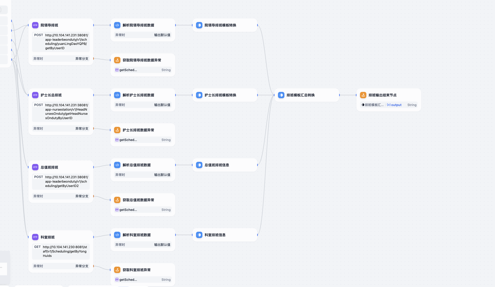
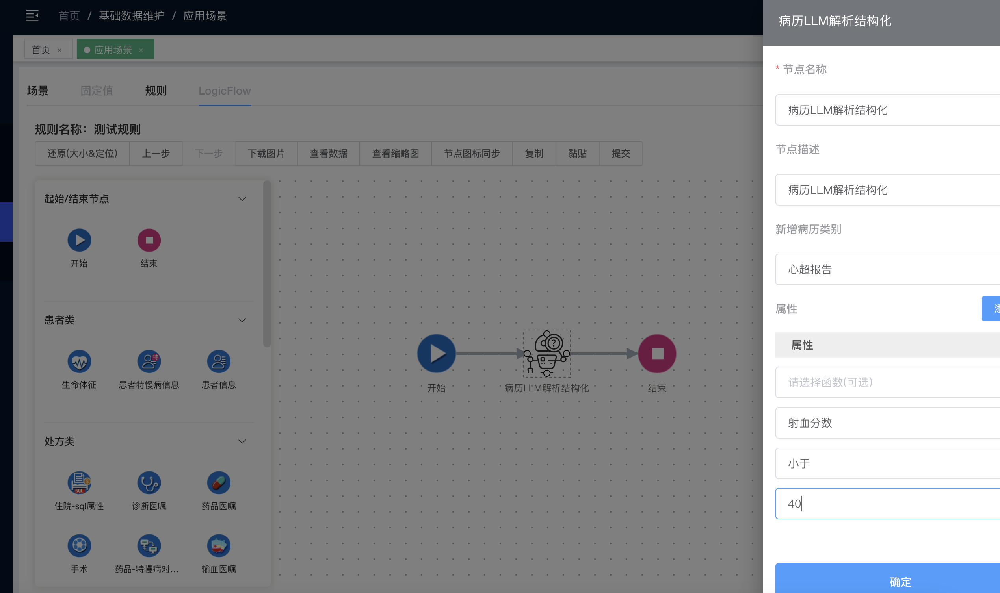
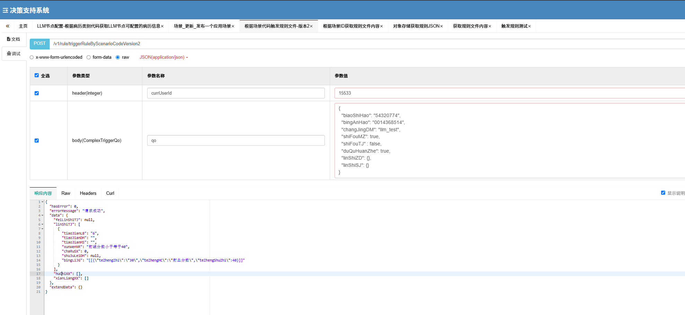
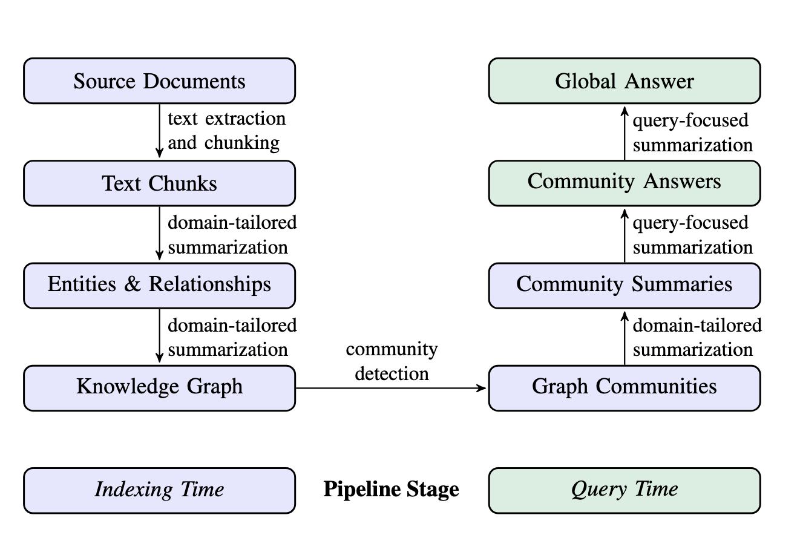

#### 员工排班输出

主要更新的点：对所有排班的结果用模板转换统一格式进行转换，而不是用LLM进行转换

#### 规则引擎更新

1. 属性维护更新，属性不再是一个特征名称或特征值一对进行维护，而是制定了具体的属性

#### 知识图谱研究

https://xie.infoq.cn/article/18ca7cd7702fc0f03baa02b01

| 阶段  | 输入 → 输出                    | 目的                                        |
| :---- | :----------------------------- | :------------------------------------------ |
| **1** | 文档 → 文本切片                | 将语料拆分为适配 LLM 上下文窗口的小块       |
| **2** | 文本切片 → 实体 & 关系         | 通过 LLM 提示提取命名实体、关系和事实性陈述 |
| **3** | 实体 & 关系 → 知识图谱         | 构建节点—边缘图谱，并合并重复实体           |
| **4** | 知识图谱 → 社区划分            | 使用 Leiden 算法进行层级社区检测            |
| **5** | 社区 → 社区摘要                | 并行生成每个社区的概览报告（自下而上聚合）  |
| **6** | 社区摘要 → 中间答案 → 全局答案 |                                             |

##### 员工办事指南实体分割

用了一次中文分割和英文分割，个人提感是英文分割的效果更好

1. **Department**（部门）
   - 如党政综合办公室（Party and Administration Office）、医务处（Medical Affairs Office）、护理部（Nursing Department）等。
2. **Position**（职位）
   - 如主任（Director）、联系人（Contact Person）、负责人（Responsible Person）等。
3. **Service**（服务）
   - 如“医院印章使用申请”（Hospital Seal Application）、“胸牌补做、更换申请”（Badge Replacement）、“医师执业注册”（Physician License Registration）等。
4. **Process**（流程）
   - 如“OA提交申请→科室审批→相关部门审批”（OA Submission → Department Approval → Relevant Department Approval）等标准化流程。
5. **Contact**（联系方式）
   - 电话号码（55578181）、办公室地点（1-4A01）等。
6. **Regulation**（规章制度）
   - 如“首接负责制”（First-Contact Responsibility System）、“信访条例”（Petition Regulations）等。
7. **Location**（地点）
   - 具体位置（如新院1-4A01、老院9号楼203室）及功能区（如会议室、收发室）。
8. **Role**（角色）
   - 如“首接责任人”（First-Contact Responsible Person）、“经办人”（Operator）、“审批人”（Approver）等。
9. **Procedure**（程序/步骤）
   - 如“填写申请表→提交审核→领取新章”（Fill Form → Submit for Review → Collect New Seal）。
10. **Form/Template**（表格/模板）
    - 如《对外用章审批单》（External Seal Approval Form）、《科研假审批表》（Research Leave Approval Form）等。
11. **Document**（文档）
    - 如《温医一院医师多点执业管理办法》（Multi-Practice Management Regulations）、《新技术新项目申请表》（New Technology/Project Application Form）。
12. **Equipment**（设备）
    - 如“医用耗材申购”（Medical Consumables Purchase）、“科研设备申请”（Research Equipment Application）。
13. **Event**（事件）
    - 如“职业暴露处理”（Occupational Exposure Handling）、“医疗投诉处理”（Medical Complaint Resolution）。
14. **Training**（培训）
    - 如“医院感染培训”（Hospital Infection Training）、“处方权考试”（Prescription Authority Exam）。
15. **License/Certification**（许可证/证书）
    - 如“母婴保健技术服务执业许可证”（Maternal and Child Health Service License）、“医师执业证书”（Physician Practice Certificate）。
