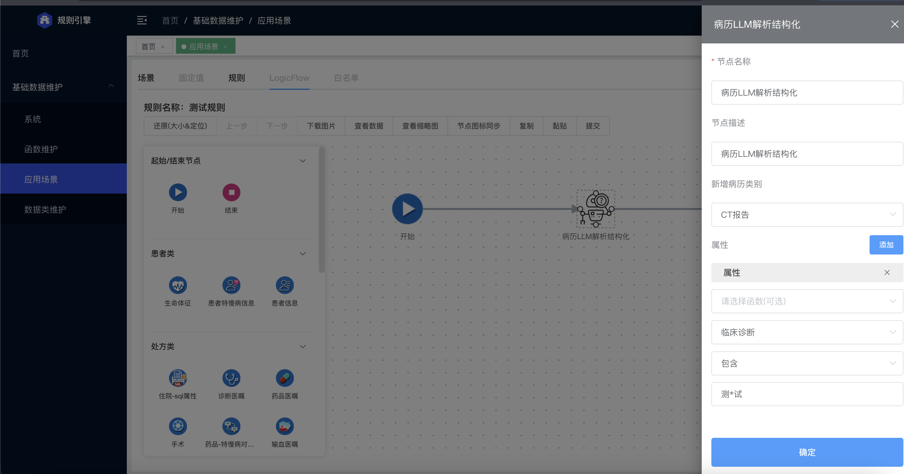
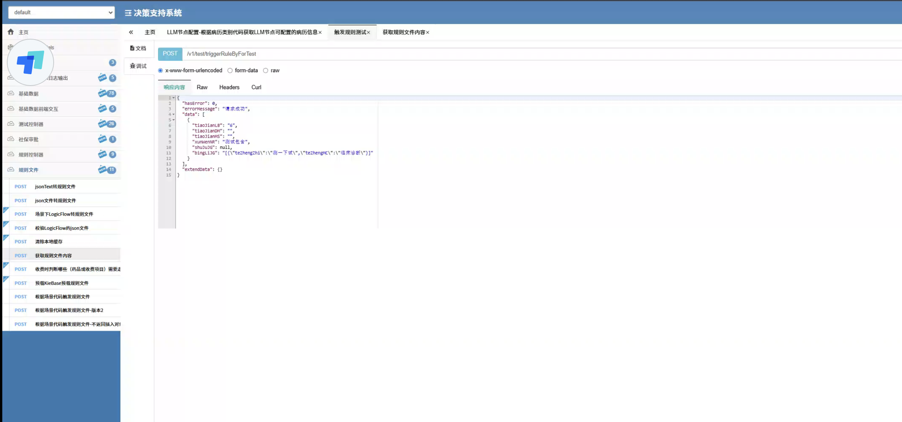
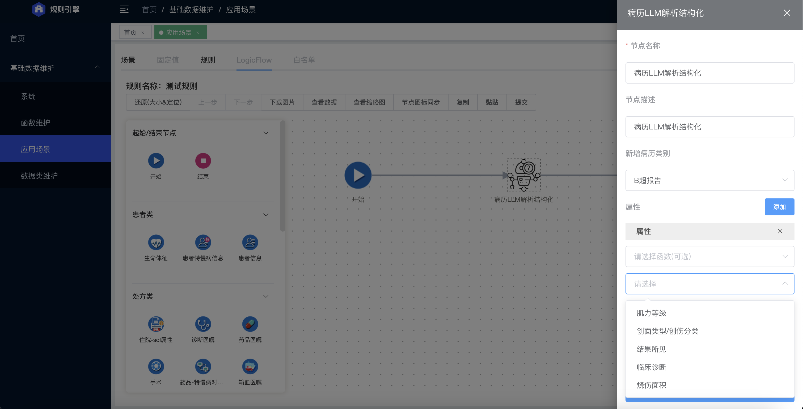
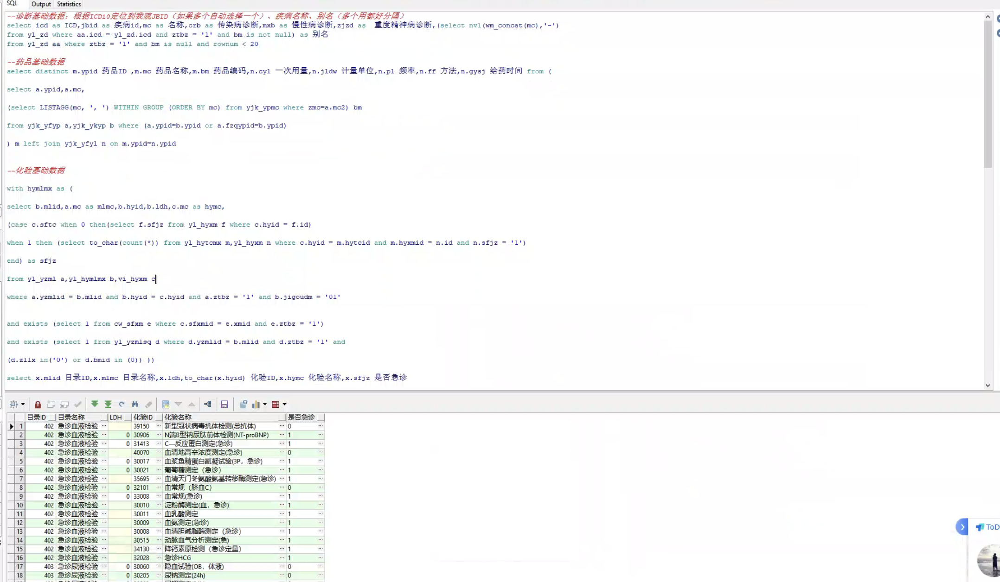
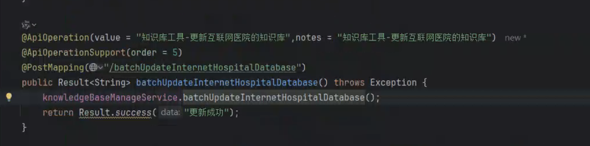
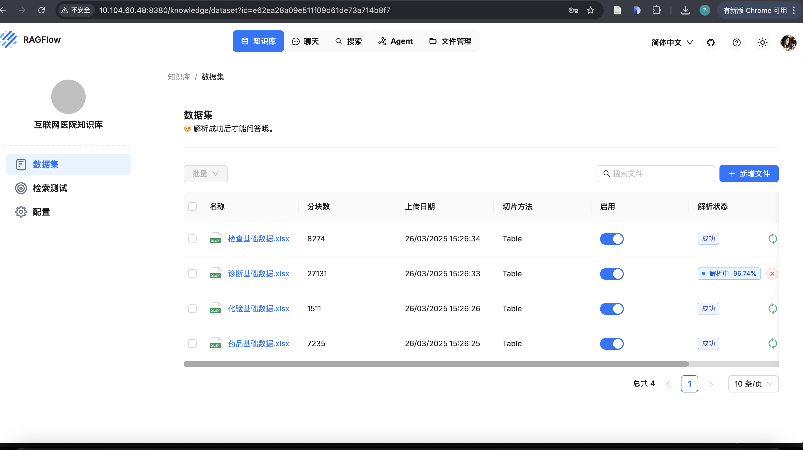

### 

#### 1. 规则引擎优化

支持包含操作用*模糊匹配，已支持在LLM节点内进行模糊包含的匹配操作， ||, &&



```json
{
  "jianChaLX": "CT",
  "bingLiLB": "CT报告单",
  "teZhengXM": [
    {"teZhengMC": "烧伤面积", "teZhengZhi": "45"},
    {"teZhengMC": "临床诊断", "teZhengZhi": "测一下试"},
    {"teZhengMC": "烧伤等级", "teZhengZhi": "三级"}
  ],
  "teZhengXM2": [
    {"teZhengMC": "射血分数", "teZhengZhi": "30", "teZhengShuZhi": 40}
  ]
}
```



报告新增属性（包括结果所见和临床诊断)



#### 2. 知识库相关的接口

2.1已在app-ai项目里实现知识库部分接口，待补全和优化

2.2 互联网医院需求：SQL转知识库

互联网医院的对应SQL







