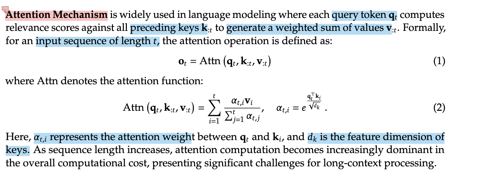
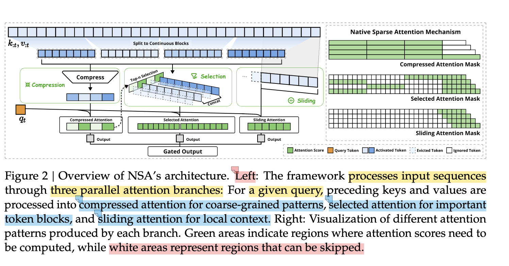

- # 大模型论文导读：Native Sparse Attention: Hardware-Aligned and Natively Trainable Sparse Attention

  ## 简介
  这篇文章提出了一种新型的稀疏注意力机制——Native Sparse Attention（NSA），它通过硬件对齐优化，使得稀疏注意力不仅能够高效地训练，还能在硬件上进行加速。该方法旨在解决现有稀疏注意力算法在训练和推理时效率低下的问题，并通过与硬件架构的深度融合，提升了计算效率和模型性能。

  ## 背景与动机
  - **研究动机**：传统的稠密注意力机制（如Transformer）在处理长序列时计算量巨大，导致内存消耗大和计算效率低。稀疏注意力（如Linformer、Reformer）通过减少注意力计算的量，能够有效降低计算开销。尽管如此，现有的稀疏注意力方法在训练时通常会牺牲一些性能。
    
  - **当前挑战**：稀疏注意力方法普遍面临硬件优化不足的问题。许多稀疏方法在理论上高效，但由于它们与现有硬件架构不对齐，实际性能往往无法达到预期。

  - **相关工作**：
    - **Linformer**：通过固定模式的稀疏化来减少计算量，但这种模式与硬件架构并不总是兼容。
    - **Reformer**：通过局部敏感哈希（LSH）实现稀疏注意力，但缺乏针对硬件优化的设计。
    - **Longformer**：采用滑动窗口的方式进行稀疏化，适用于特定的任务，但在通用硬件上仍有局限。

  ## 方法论与技术
  在理解NSA之前，我们需要先理解Attention注意力机制，基于谷歌的《Attention is All you Need 》

  

  #### 传统Attention注意力机制

  Attention注意力机制可以让Transformer知道词汇在一个句子或一个文本中的相关程度

  **重点**：所有的在单词都可以被映射为三种向量（todo解释query，key和value）

  1. Query：
  2. Key
  3. Value

  

  注意力机制的公式：
  $$
  Attention(Q,K,V) = softmax(\frac{QK^T}{\sqrt{d_k}})V
  $$
  在论文中Attention的注意力机制被描述成下方的公式
  $$
  o_t= Attn(q_t,k_{:t},v_{:t})
  $$

  $$
  Attn(q_t,k_{:t},v_{:t})= \sum_{i=1}^{t} \frac {\alpha_{t,i}v_i} {\sum_{j=1}^{t} \alpha_{t,j}} , {\alpha_{t,i}} = e^{\frac{{q_t}^Tk_i}{\sqrt{d_k}}}
  $$

  

  - ##### 两种注意力机制的区别在哪里

    第一个公式是标准的 Transformer 中的 **多头自注意力** 机制，论文中的公式是一种特定的实现形式，可能用于有时间步约束（例如自回归生成任务）的情境。

    1. **第一种 Attention 公式：**

       $Attention(Q,K,V) = softmax(\frac{QK^T}{\sqrt{d_k}})V$

       这个公式是**标准的注意力机制**，通常应用于Transformer模型中。

       - ​	$\frac{QK^T}{\sqrt{d_k}}$是通过**计算查询矩阵** $Q$ **与键矩阵**$ K$ **的点积**来获得相似度，这个相似度通过除以 $\sqrt{d_k}$ 进行缩放
       - 接着，使用**softmax**操作来归一化相似度（即注意力权重），将它们转换为一个合法的概率分布。
       - 最终的输出是这些权重与值矩阵 V 的加权和。

    2. **第二种Attention公式：**

       $Attn(q_t,k_{:t},v_{:t})= \sum_{i=1}^{t} \frac {\alpha_{t,i}v_i} {\sum_{j=1}^{t} \alpha_{t,j}} , {\alpha_{t,i}} = e^{\frac{{q_t}^Tk_i}{\sqrt{d_k}}}$

       - 这个公式是针对**自回归模型**中的注意力机制，具体来说，它是指在时间步 t 时刻，当前查询向量 $q_t$ 和之前所有的键 $k_{1}$, $k_2$, …, $k_t$ 及对应的值 $v_1$,$ v_2$, …, $v_t$ 进行加权求和。
       - ​	权重$\alpha_{t,i}$ 对应的是当前查询向量 $q_t$ 与所有键向量$ k_i$ 的相似度，这里是使用了**指数形式**。
       - 最后，输出是所有值$ v_i$ 的加权和，权重是基于查询与键的相似度来决定的，但**没有显式的归一化过程**，而是通过分母对所有权重进行统一归一化。

  > [!NOTE]
  >
  > **自回归 (Autoregressive)** 和 **非自回归 (Non-autoregressive)** 是两种不同的模型生成方式，它们在序列生成和预测过程中有着明显的区别。
  >
  > 
  >
  > **自回归 (Autoregressive) 模型：**
  >
  > 
  >
  > 自回归模型的生成过程是**逐步递归**的，即在生成每个词或每个元素时，模型都会依赖于前面已生成的部分。
  >
  > 
  >
  > **特点：**
  >
  > ​	1.	**逐步生成：** 每次生成一个输出元素，模型会基于**前一步生成的内容**来决定当前的输出。换句话说，每个步骤的输出都依赖于前一个步骤的输出。
  >
  > ​	2.	**典型模型：** 例如 **GPT (Generative Pretrained Transformer)** 和 **RNN (Recurrent Neural Network)** 都是自回归模型，它们会根据前面生成的词预测下一个词。
  >
  > ​	3.	**生成速度较慢：** 由于生成过程是顺序进行的，所以模型生成每个输出时必须依赖于之前生成的内容，导致生成速度较慢。
  >
  > ​	4.	**高质量生成：** 在某些任务（如语言模型和机器翻译）中，自回归模型由于依赖先前生成的信息，能够更好地捕捉上下文，生成的文本质量通常较高。
  >
  > 
  >
  > **例子：**
  >
  > ​	•	**语言模型：** 在生成下一个词时，模型会基于之前的词（例如，前面生成的句子）来预测下一个词。例如：生成句子时，模型会基于 “The cat is on the” 来预测下一个词 “mat”。
  >
  > ​	•	**机器翻译：** 生成每个目标语言的单词时，模型会基于已翻译的部分来逐步生成整个翻译句子。
  >
  > 
  >
  > **非自回归 (Non-autoregressive) 模型：**
  >
  > 
  >
  > 非自回归模型则是通过一次性生成整个序列或多个元素，而**不依赖于前一步的输出**。它们更侧重于并行化。
  >
  > 
  >
  > **特点：**
  >
  > ​	1.	**并行生成：** 与自回归模型不同，非自回归模型通常会**同时生成整个输出序列**，而不需要依赖于已经生成的部分。这意味着它们可以大大提高生成速度。
  >
  > ​	2.	**典型模型：** 例如 **BERT (Bidirectional Encoder Representations from Transformers)** 和某些类型的 **非自回归机器翻译模型**。这些模型使用编码器-解码器结构，可能在解码阶段同时生成所有词，而不依赖于逐步生成。
  >
  > ​	3.	**生成速度较快：** 由于所有元素是同时生成的，因此可以并行计算，生成速度比自回归模型要快得多。
  >
  > ​	4.	**质量较差：** 由于不依赖上下文生成，因此可能会在某些任务中生成的内容质量不如自回归模型。例如，生成的句子可能缺少语法的连贯性，或上下文关系不够紧密。
  >
  > 
  >
  > **例子：**
  >
  > ​	•	**机器翻译：** 非自回归机器翻译模型可以在翻译过程中并行生成整个目标句子，而不需要一个词接一个词地逐步生成。
  >
  > ​	•	**图像生成：** 非自回归模型有时用于图像生成任务，它们可能通过某种方式一次性生成完整图像，而不是通过逐步生成图像的不同部分。
  >
  > 
  >
  > **总结：**
  >
  > ​	1.	**生成方式：**
  >
  > ​	•	自回归：逐步生成，每一步的输出依赖于之前的输出。
  >
  > ​	•	非自回归：并行生成，多个输出元素可以同时生成。
  >
  > ​	2.	**生成速度：**
  >
  > ​	•	自回归：生成较慢，因为每个步骤依赖前一步。
  >
  > ​	•	非自回归：生成较快，因为所有步骤可以并行处理。
  >
  > ​	3.	**生成质量：**
  >
  > ​	•	自回归：通常能生成高质量、上下文紧密连贯的输出。
  >
  > ​	•	非自回归：可能质量较低，输出可能不如自回归模型连贯。
  >
  > ​	4.	**应用场景：**
  >
  > ​	•	自回归：适用于需要高质量、上下文一致性的任务，如语言建模、文本生成等。
  >
  > ​	•	非自回归：适用于需要快速生成的任务，如机器翻译、图像生成等。

  ##### 传统的注意力机制的缺陷

  

  #### NSA框架图

  

  NSA整体架构理论

  

  1. 与传统的Attention机制相比，NSA有什么优势？
  2. 

  

  ------

  文章提出的**Native Sparse Attention**（NSA）方法在硬件上进行优化，从而使得稀疏注意力的训练和推理更加高效。具体来说，NSA在以下几个方面做出了创新：

  - **硬件对齐**：通过与硬件架构（如GPU、TPU等）深度结合，优化了稀疏模式的存储和计算方式。这样可以减少不必要的数据传输，并提高内存利用率。
    
  - **可训练的稀疏模式**：NSA通过引入可学习的稀疏模式，使得在训练过程中，模型能够自适应地选择最优的稀疏化策略。这种方式不仅提高了训练效率，也提升了模型的表现。
    
  - **加速策略**：结合硬件的特性，NSA方法能够显著加速注意力计算，尤其是在长序列的情况下，能够有效降低计算成本。

  - **算法细节**：NSA在训练时通过设计一种新的稀疏化机制，使得模型可以根据训练数据自适应地调整稀疏模式。不同于传统的固定稀疏化策略，这种方式能够最大化地利用硬件并提高计算效率。

  ## 实验与结果
  - **实验设计**：文章在多个数据集上对比了NSA与现有的稀疏注意力方法以及稠密注意力方法（如标准的Transformer）。实验包括了标准的NLP任务（如文本分类、问答等），以及更具挑战性的长序列任务。
    
  - **结果分析**：实验结果表明，NSA在训练速度和推理速度上都优于现有的稀疏注意力方法，尤其在长序列任务上，性能提升显著。此外，NSA在内存消耗上也有显著的优势，能更高效地使用硬件资源。

  - **对比分析**：与Linformer、Reformer等方法相比，NSA不仅在效率上有较大优势，而且在模型性能上也保持了较高的水平，能够处理更复杂的任务。

  ## 分析与讨论
  - **论文方法的优缺点**：
    - 优点：
      - 在硬件上进行了深入优化，使得稀疏注意力方法的效率得到了大幅提升。
      - 可训练的稀疏模式提高了模型的灵活性，能够自适应地选择最优策略。
      - 通过硬件对齐，减少了数据传输和内存消耗。
    
    - 缺点：
      - 对硬件的依赖较强，需要特定的硬件环境来实现最佳性能。
      - 虽然提高了效率，但对于一些任务，模型仍然存在一定的性能瓶颈。

  - **可能的改进方向**：
    - 探索如何在不同的硬件平台上进一步优化NSA，尤其是针对不同规模的计算资源。
    - 研究如何将NSA与其他优化技术（如低秩分解、量化等）结合，进一步提升计算效率和模型性能。

  - **论文的局限性**：
    - 由于硬件依赖性较强，NSA在某些通用硬件上可能无法发挥最大的效用，限制了其广泛应用。

  ## 总结与展望
  - **文章贡献总结**：本文提出的NSA方法通过硬件对齐和可训练的稀疏模式，解决了稀疏注意力方法在训练和推理时的效率问题。实验结果表明，NSA在多个任务上表现出色，尤其在长序列处理上具有显著的优势。
    
  - **未来的研究方向**：
    - 可以进一步探索如何将NSA与其他计算优化技术结合，例如通过硬件专用的加速器进行优化，或者结合不同类型的神经网络架构进行改进。
    - 在不同硬件平台上进行更广泛的测试，以验证NSA的通用性和扩展性。

  ## 个人笔记与灵感
  - **个人想法**：我认为NSA的方法提供了一个非常有前景的思路，尤其是在需要处理大规模数据时，通过优化硬件和模型的结合，能够显著提升效率。未来可以考虑如何在低资源硬件上优化NSA，使其更加普及。
    
  - **对其他研究的启示**：这篇文章让我想到，未来的稀疏化技术不仅仅是一个数学问题，如何与硬件进行深度结合、提升计算效率，将是一个非常重要的研究方向。

  - **与自己研究的关系**：我的研究方向也涉及到大规模数据处理，NSA的方法为我提供了很多启发，尤其是在硬件优化和稀疏化方面，我可能会尝试将这些思想应用到我的研究中。

  ## 参考文献
  - [1] **Native Sparse Attention: Hardware-Aligned and Natively Trainable Sparse Attention**, 作者, 发表时间.
  - [2] **Linformer: Self-Attention with Linear Complexity**, 作者, 发表时间.
  - [3] **Reformer: The Efficient Transformer**, 作者, 发表时间.