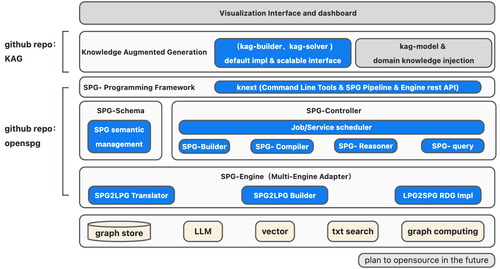

# OpenSPG

* 是蚂蚁集团结合多年金融领域多元场景知识图谱构建与应用业务经验的总结，并与OpenKG联合推出的基于SPG(Semantic-enhanced Programmable Graph)框架研发的知识图谱引擎。

  [OpenSPG/openspg: OpenSPG is a Knowledge Graph Engine developed by Ant Group in collaboration with OpenKG, based on the SPG (Semantic-enhanced Programmable Graph) framework. Core Capabilities: 1) domain model constrained knowledge modeling, 2) facts and logic fused representation, 3) natively support KAG...](https://github.com/OpenSPG/openspg)

* [语义增强可编程知识图谱-白皮书v1.0.pdf](assets/语义增强可编程知识图谱-白皮书v1.0-20250113162418-irgcloy.pdf)

‍

​​
![[file-20250331143901912.png]]