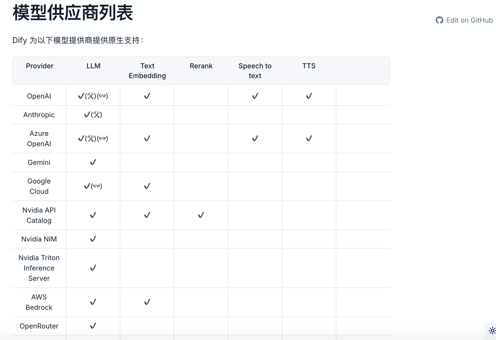

## Dify

#### Dify简介

**Dify** 是一款开源的大语言模型(LLM) 应用开发平台。它融合了后端即服务（Backend as Service）和 [LLMOps](https://docs.dify.ai/zh-hans/learn-more/extended-reading/what-is-llmops) 的理念，使开发者可以快速搭建生产级的生成式 AI 应用。即使你是非技术人员，也能参与到 AI 应用的定义和数据运营过程中。

由于 Dify 内置了构建 LLM 应用所需的关键技术栈，包括对数百个模型的支持、直观的 Prompt 编排界面、高质量的 RAG 引擎、稳健的 Agent 框架、灵活的流程编排，并同时提供了一套易用的界面和 API。这为开发者节省了许多重复造轮子的时间，使其可以专注在创新和业务需求上。

Dify官网链接：https://docs.dify.ai/zh-hans

#### 为什么使用Dify？

Dify是一个==低代码平台==，可以把 LangChain 这类的开发库（Library）想象为有着锤子、钉子的工具箱。与之相比，Dify 提供了更接近生产需要的完整方案，Dify 好比是一套脚手架，并且经过了精良的工程设计和软件测试。

#### Dify部署

##### Docker部署

